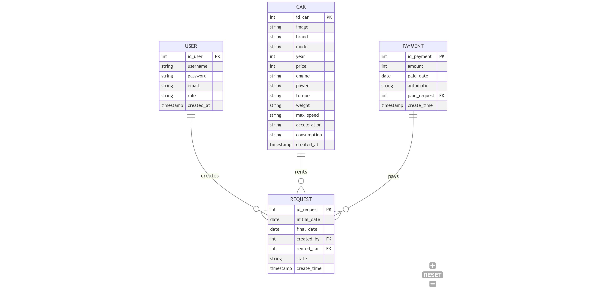

# 🚗Car Rental Car System

Este proyecto es una aplicación web para gestionar alquileres de coches.

## 🧵UML Rental Car System

| Car                        | User                      | Request                    | Payment                   |
|----------------------------|---------------------------|----------------------------|---------------------------|
| - id_car: INT              | - id_user: INT            | - id_request: INT          | - id_payment: INT         |
| - image: VARCHAR           | - username: VARCHAR       | - initial_date: DATE       | - amount: INT             |
| - brand: VARCHAR           | - password: VARCHAR       | - final_date: DATE         | - paid_date: DATE         |
| - model: VARCHAR           | - email: VARCHAR          | - created_by: INT          | - automatic: VARCHAR      |
| - year: INT                | - role: VARCHAR           | - rented_car: INT          | - paid_request: INT       |
| - price: INT               | - created_at: TIMESTAMP   | - state: VARCHAR           | - create_time: TIMESTAMP  |
| - engine: VARCHAR          |                           | - create_time: TIMESTAMP   |                           |
| - power: VARCHAR           |                           |                            |                           |
| - torque: VARCHAR          |                           |                            |                           |
| - weight: VARCHAR          |                           |                            |                           |
| - max_speed: VARCHAR       |                           |                            |                           |
| - acceleration: VARCHAR    |                           |                            |                           |
| - consumption: VARCHAR     |                           |                            |                           |
| - created_at: TIMESTAMP    |                           |                            |                           |



## Recorrido de un pedido a la Api

    ejemplo solicitud de todos los usuarios a la ruta api/user
    index.ts --> routes/user.ts --> controller/user.controller.ts --> services/user.service.ts --> entities/user.entity.ts(configuracion de la base de datos)

Initially appeared on
[gist](https://gist.github.com/PurpleBooth/109311bb0361f32d87a2). But the page cannot open anymore so that is why I have moved it here.

## Getting Started

These instructions will give you a copy of the project up and running on
your local machine for development and testing purposes. See deployment
for notes on deploying the project on a live system.

## Estructura de Carpetas

#### db

- `db.sql`: ejemplo del diseño de la base de datos.

#### src

- `/config`: Configuracion de la api (entity,dto,services,config), base de datos (data.source.ts) y control de los registros (logging.ts) .
- `/controllers`: Manejo de entrada de datos, logica de negocio .
- `/dto`: Definicion de la estructura de datos.
- `/interfaces`: ejemplo del diseño de la base de datos.
- `/middlewares`: ejemplo del diseño de la base de datos.
- `/migration`: ejemplo del diseño de la base de datos.
- `/routes`: ejemplo del diseño de la base de datos.
- `/services`: ejemplo del diseño de la base de datos.
- `/shared`: ejemplo del diseño de la base de datos.
- `/strategies`: ejemplo del diseño de la base de datos.
- `/utils`: ejemplo del diseño de la base de datos.

# 🚀 CLI Generador de Features y Entidades

Este proyecto incluye un sistema de generación de archivos mediante comandos CLI para agilizar la creación de módulos como controladores, rutas, DTOs, entidades, etc.

## 📁 Estructura del CLI

```
cli/
├── generators/
│   ├── feature.generator.js       ← Generador para módulos comunes
│   └── entity.generator.js        ← Generador para módulos con entidad y servicio
├── templates/
│   ├── controller.template
│   ├── dto.template
│   ├── entity.template
│   ├── middleware.template
│   ├── route.template
│   └── service.template
```

## 🛠️ Comandos disponibles

En el archivo `package.json` se definen los siguientes scripts:

```json
"scripts": {
  "cli:generate": "node cli/cli-generator.js"
}
```

> ⚠️ Asegúrate de tener los archivos `.template` correctamente configurados dentro de `cli/templates/`.

## 📌 Uso

### ➕ Generar una feature (sin entidad ni servicio)

Crea automáticamente:

- Ruta (`routes/`)
- Controlador (`controllers/`)
- Middleware (`middlewares/`)
- DTO (`dto/`)

```bash
npm run cli:generate feature nombre
```

**Ejemplo:**

```bash
npm run cli:generate feature email
```

Esto generará:

```
src/
├── controllers/email.controller.ts
├── dto/email.dto.ts
├── middlewares/email.middleware.ts
└── routes/email.routes.ts
```

---

### 🧱 Generar una entidad (con DTO, controller, service, etc.)

Crea todo lo anterior más:

- Servicio (`services/`)
- Entidad (`entities/`)

```bash
npm run cli:generate entity nombre
```

**Ejemplo:**

```bash
npm run cli:generate entity car
```

Esto generará:

```
src/
├── controllers/car.controller.ts
├── dto/car.dto.ts
├── entities/car.entity.ts
├── middlewares/car.middleware.ts
├── routes/car.routes.ts
└── services/car.service.ts
```

---

## 🧩 Plantillas personalizadas

Cada archivo generado se basa en una plantilla que puede contener variables como:

- `__Name__` → Nombre con la primera letra en mayúscula (`Car`)
- `__name__` → Nombre en minúscula (`car`)

Estas variables son reemplazadas automáticamente en los archivos generados.

> Puedes modificar las plantillas ubicadas en `cli/templates/` para adaptarlas a tu estilo de código.

---

## ✅ Recomendaciones

- Asegúrate de que las carpetas `src/routes`, `src/controllers`, `src/services`, `src/middlewares`, `src/dto`, y `src/entities` existen o serán creadas automáticamente.
- Usa nombres simples en minúscula para los comandos (ej. `car`, `user`, `email`).
- Revisa que los archivos generados sigan tu patrón de arquitectura y estructura del proyecto.
