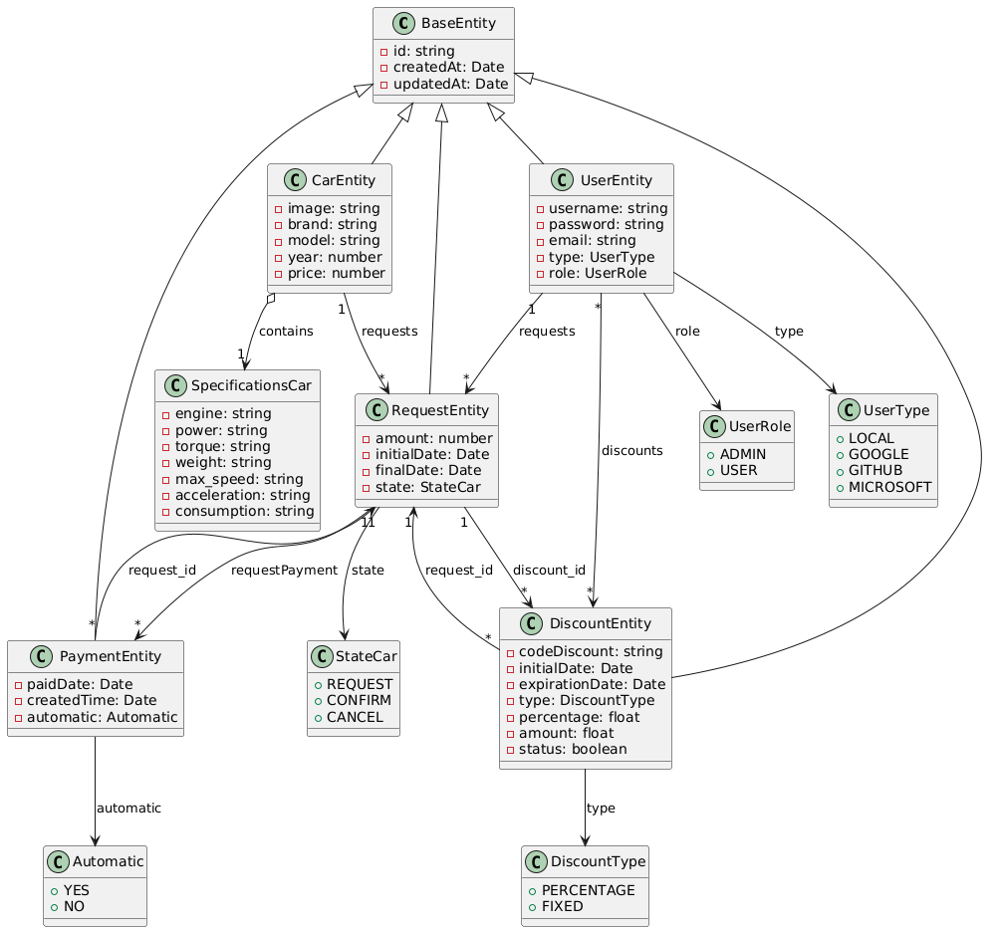

# 🚗Car Rental Car System

Este proyecto es una aplicación web para gestionar alquileres de coches.

## 🧵UML Rental Car System

| Car                     | User                                                   | Request                                       | Payment                        | Discount                            |
| ----------------------- | ------------------------------------------------------ | --------------------------------------------- | ------------------------------ | ----------------------------------- |
| - id: INT               | - id: INT                                              | - id: INT                                     | - id: INT                      | - id: INT                           |
| - image: VARCHAR        | - username: VARCHAR                                    | - amount: FLOAT                               | - paidDate: DATE               | - codeDiscount: VARCHAR             |
| - brand: VARCHAR        | - password: VARCHAR                                    | - initialDate: DATE                           | - createdTime: TIMESTAMP       | - initialDate: DATE                 |
| - model: VARCHAR        | - email: VARCHAR                                       | - finalDate: DATE                             | - automatic: ENUM('YES', 'NO') | - expirationDate: DATE              |
| - year: INT             | - type: ENUM('LOCAL', 'GOOGLE', 'GITHUB', 'MICROSOFT') | - state: ENUM('REQUEST', 'CONFIRM', 'CANCEL') | - request_id: INT              | - type: ENUM('PERCENTAGE', 'FIXED') |
| - price: FLOAT          | - role: ENUM('ADMIN', 'USER')                          | - user_id: INT                                | - createdAt: TIMESTAMP         | - percentage: FLOAT                 |
| - engine: VARCHAR       | - createdAt: TIMESTAMP                                 | - car_id: INT                                 | - updatedAt: TIMESTAMP         | - amount: FLOAT                     |
| - power: VARCHAR        | - updatedAt: TIMESTAMP                                 | - createdAt: TIMESTAMP                        |                                | - status: BOOLEAN                   |
| - torque: VARCHAR       |                                                        | - updatedAt: TIMESTAMP                        |                                | - request_id: INT                   |
| - weight: VARCHAR       |                                                        |                                               |                                | - createdAt: TIMESTAMP              |
| - max_speed: VARCHAR    |                                                        |                                               |                                | - updatedAt: TIMESTAMP              |
| - acceleration: VARCHAR |                                                        |                                               |                                |                                     |
| - consumption: VARCHAR  |                                                        |                                               |                                |                                     |
| - createdAt: TIMESTAMP  |                                                        |                                               |                                |                                     |
| - updatedAt: TIMESTAMP  |                                                        |                                               |                                |                                     |

## 🪡Diagrama de Entidades



## 🛣️ Recorrido de un pedido a la Api

    ejemplo solicitud de todos los usuarios a la ruta api/user
    index.ts --> routes/user.ts --> controller/user.controller.ts --> (opcional) use-case/login.use-case.ts -->services/user.service.ts --> entities/user.entity.ts(configuracion de la base de datos)

Initially appeared on
[gist](https://gist.github.com/PurpleBooth/109311bb0361f32d87a2). But the page cannot open anymore so that is why I have moved it here.

## 🚀 Instrucciones para Empezar

Estas instrucciones te guiarán para obtener una copia del proyecto y ejecutarlo en tu máquina local con fines de desarrollo y pruebas. Consulta la sección de despliegue para más detalles sobre cómo implementar el proyecto en un sistema en producción.
Este proyecto está estructurado siguiendo una arquitectura de capas inspirada en Clean Architecture, respetando los principios SOLID. Esto garantiza una separación clara de responsabilidades, facilidad de mantenimiento y escalabilidad. A continuación, te detallo los pasos necesarios para ponerlo en marcha.

Estas instrucciones te guiarán para obtener una copia del proyecto y ejecutarlo en tu máquina local con fines de **desarrollo** y **pruebas**. Consulta la sección de **despliegue** para más detalles sobre cómo implementar el proyecto en un sistema en producción.

Este proyecto está estructurado siguiendo una **arquitectura de capas** inspirada en **Clean Architecture**, respetando los **principios SOLID**. Esto garantiza una separación clara de responsabilidades, facilidad de mantenimiento y escalabilidad. A continuación, te detallo los pasos necesarios para ponerlo en marcha.

### 📋 Requisitos Previos

Asegúrate de tener instalados los siguientes componentes en tu máquina:

- **Node.js** (versión 14.x o superior)
- **npm** (versión 6.x o superior)
- **MySQL** (versión 5.7 o superior) u otro sistema de gestión de bases de datos compatible con **TypeORM**

### 🛠️ Pasos para la Instalación

1. **Clonar el Repositorio**

    ```bash
    git clone https://github.com/tu-usuario/tu-repositorio.git
    cd tu-repositorio
    ```

2. **Instalar Dependencias**

    ```bash
    npm install
    ```

3. **Configurar la Base de Datos**
    - Crea una base de datos en **MySQL**:

        ```sql
        CREATE DATABASE car_rental;
        ```

    - Configura las variables de entorno en un archivo `.env` basado en el archivo `.env.example` que debería estar incluido en el proyecto. Ejemplo:

        ```
        DB_HOST=localhost
        DB_PORT=3306
        DB_USERNAME=tu_usuario
        DB_PASSWORD=tu_contraseña
        DB_DATABASE=car_rental
        ```

4. **Ejecutar Migraciones**
    - Este proyecto utiliza **TypeORM** para la gestión de la base de datos, incluyendo **migraciones** para mantener el esquema actualizado:

        ```bash
        npm run typeorm migration:run
        ```

5. **Ejecutar Seeds (Opcional)**
    - Si deseas poblar la base de datos con datos de prueba, usa los **seeds** proporcionados:

        ```bash
        npm run seed:run
        ```

6. **Iniciar el Servidor**
    - Inicia el servidor en modo **desarrollo**:

        ```bash
        npm run start:dev
        ```

7. **Crear una migración (Opcional)**
    - Si necesitas crear una **migration**, podes crearla atravez del siguiente comando:

        ```bash
        npm run m:generate -- src/infrastructure/db/migration/nombreDeMigracion
        ```

    - Se Alcamenara en la carpeta `src/infrastructure/db/migration` junto con las demas migraciones.
    - Luego para poder ejecutar los cambios de la **migration** podes hacerlo con el siguiente comando:

        ```bash
        npm run m:run
        ```

8. **Acceder a la API**
    - La **API** estará disponible en `http://localhost:3000/api`

## 🌟 Características del Proyecto

- **Arquitectura de Capas y Clean Architecture**: El proyecto está diseñado con una estructura modular que separa las responsabilidades en capas, siguiendo los principios de **Clean Architecture** y **SOLID**.
- **TypeORM**: Implementa una base de datos relacional con soporte para **migraciones**, **seeds** y **entidades** definidas en la carpeta `entities`.
- **DTOs**: Utiliza objetos de transferencia de datos (ubicados en `dto`) para validar y estructurar la información enviada y recibida.
- **Autenticación con Passport**: La autenticación está implementada con **Passport.js**, utilizando estrategias como **JWT** para proteger las rutas de la API.
- **Estructura de Respuesta HTTP**: Define un formato consistente para las respuestas **HTTP**, facilitando la integración con clientes frontend.
- **Manejo de Errores**: Incluye un sistema centralizado para manejar **errores** y devolver respuestas **HTTP** claras y útiles.

## 📂Estructura de Carpetas

#### /db

- `db.sql`: Dump o esquema inicial de la base de datos (estructura de tablas, relaciones, seeds, etc.).

#### /src

- `/config`: Configuración general del proyecto (entorno, base de datos, logging, DTOs de configuración).
- `/controllers`: Encapsulan la lógica de entrada/salida HTTP. Orquestan servicios y formatean la respuesta.
- `/dto`: Definición de Data Transfer Objects para validación y tipado de datos entrantes.
- `/entities`: Mapeo de entidades ORM que representan las tablas de la base de datos.
- `/interfaces`: Definición de contratos (TypeScript interfaces) usados para inyectar servicios en los use-cases, garantizando el cumplimiento de métodos esperados y favoreciendo el desacoplamiento entre capas.
- `/middlewares`: Funciones que interceptan las requests/responses (auth, errores, validaciones).
- `/providers`: Servicios externos o recursos reutilizables (ej: adapters de email, cache, storage).
- `/migration`: Scripts de migración de la base de datos (versión actual, historial).
- `/routes`: Definición y agrupación de rutas de la API (importa y conecta controladores).
- `/seeds`: Scripts para poblar la base de datos con datos iniciales o de prueba.
- `/services`: Contienen la lógica de negocio central y acceso a datos (reutilizados por controllers).
- `/shared`: Utilidades, clases base o módulos comunes compartidos en distintos contextos.
- `/strategies`: Estrategias específicas (ej: Passport, JWT, OAuth) para autenticación o autorización.
- `/use-case`: Implementación explícita de casos de uso según la lógica del dominio.
- `/utils`: Funciones auxiliares y helpers puros reutilizables en el proyecto.
- `index.ts`: Punto de entrada principal. Inicializa y lanza la aplicación (servidor, middlewares, rutas).

### 🧩 Estructura y Arquitectura

El proyecto sigue una arquitectura por capas inspirada en principios de Clean Architecture. Se separan responsabilidades de forma clara:

- **Controllers**: gestionan la entrada/salida HTTP. No contienen lógica de negocio.
- **Use-cases**: encapsulan la lógica de aplicación. Orquestan múltiples servicios, controlan errores y determinan qué respuesta se debe emitir.
- **Services**: acceden a fuentes de datos (ej. base de datos) y devuelven resultados puros, sin lógica HTTP.
- **Interfaces**: definen contratos de los servicios y otros componentes para favorecer la inversión de dependencias, la flexibilidad y el testeo.

# 🚀 CLI Generador de Features y Entidades

Este proyecto incluye un sistema de generación de archivos mediante comandos CLI para agilizar la creación de módulos como controladores, rutas, DTOs, entidades, etc.

## 📁 Estructura del CLI

```
cli/
├── generators/
│   ├── entity.generator.js        ← Generador para módulos con entidad (entity + service + repositorio)
│   └── feature.generator.js       ← Generador para módulos comunes (controller + middleware + route)
├── templates/
│   ├── controller-entity.template ← Controller orientado a entidades
│   ├── controller-feature.template← Controller para features simples
│   ├── dto.template               ← Plantilla de DTO
│   ├── entity-db.template         ← Plantilla de entidad de base de datos
│   ├── entity-domain.template     ← Plantilla de entidad de dominio
│   ├── interface-repo.template    ← Interfaz del repositorio
│   ├── mapper.template            ← Mapper de entidades
│   ├── middleware.template        ← Middleware genérico
│   ├── repository.template        ← Repositorio concreto
│   └── route.template             ← Definición de rutas
├── utils/
│   ├── factory-injector.js        ← Inyección automática en factories
│   ├── factory-utils.js           ← Funciones auxiliares para modificar factories
│   ├── file-utils.js              ← Funciones para crear/editar archivos
│   ├── cli-generators.js          ← Registro central de generadores CLI
│   ├── generate.js                ← Punto de entrada CLI
│   └── open-features.js           ← Utilidad para abrir features disponibles

```

## 🛠️ Comandos disponibles

En el archivo `package.json` se definen los siguientes scripts:

```json
"scripts": {
  "cli:generate": "node cli/cli-generator.js"
}
```

> ⚠️ Asegúrate de tener los archivos `.template` correctamente configurados dentro de `cli/templates/`.

## 📌 Uso

### ➕ Generar una feature (sin entidad ni servicio)

Crea automáticamente:

- Ruta (`routes/`)
- Controlador (`controllers/`)
- Middleware (`middlewares/`)
- DTO (`dto/`)

```bash
npm run cli:generate feature nombre
```

**Ejemplo:**

```bash
npm run cli:generate feature email
```

Esto generará:

```
src/
├── controllers/email.controller.ts
├── dto/email.dto.ts
├── middlewares/email.middleware.ts
└── routes/email.routes.ts
```

---

### 🧱 Generar una entidad (con DTO, controller, service, etc.)

Crea todo lo anterior más:

- Servicio (`services/`)
- Entidad (`entities/`)

```bash
npm run cli:generate entity nombre
```

**Ejemplo:**

```bash
npm run cli:generate entity car
```

Esto generará:

```
src/
├── controllers/car.controller.ts
├── dto/car.dto.ts
├── entities/car.entity.ts
├── middlewares/car.middleware.ts
├── routes/car.routes.ts
└── services/car.service.ts
```

---

## 🧩 Plantillas personalizadas

Cada archivo generado se basa en una plantilla que puede contener variables como:

- `__Name__` → Nombre con la primera letra en mayúscula (`Car`)
- `__name__` → Nombre en minúscula (`car`)

Estas variables son reemplazadas automáticamente en los archivos generados.

> Puedes modificar las plantillas ubicadas en `cli/templates/` para adaptarlas a tu estilo de código.

---

## ✅ Recomendaciones

- Asegúrate de que las carpetas `src/routes`, `src/controllers`, `src/services`, `src/middlewares`, `src/dto`, y `src/entities` existen o serán creadas automáticamente.
- Usa nombres simples en minúscula para los comandos (ej. `car`, `user`, `email`).
- Revisa que los archivos generados sigan tu patrón de arquitectura y estructura del proyecto.
